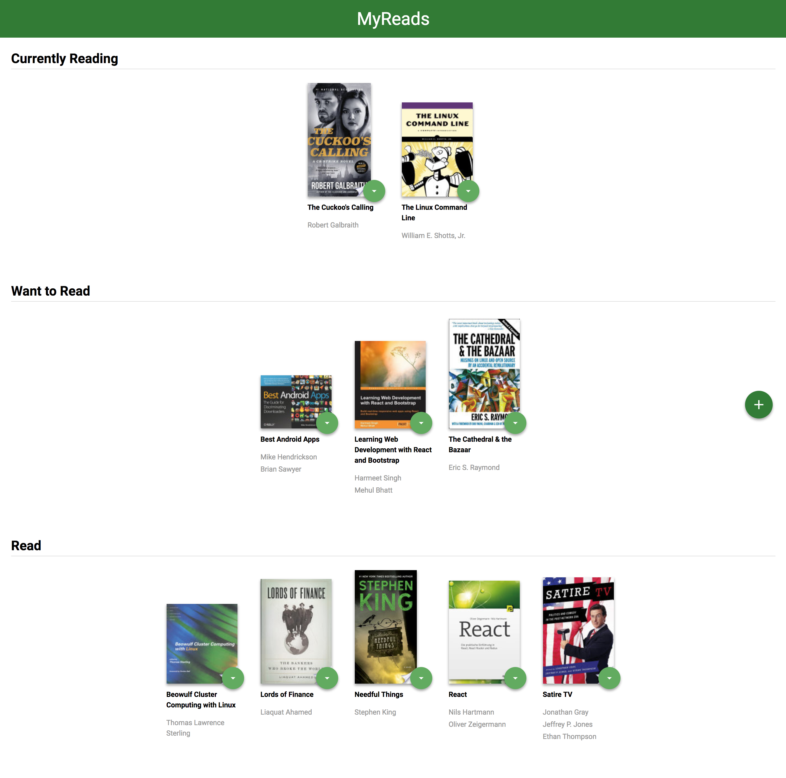
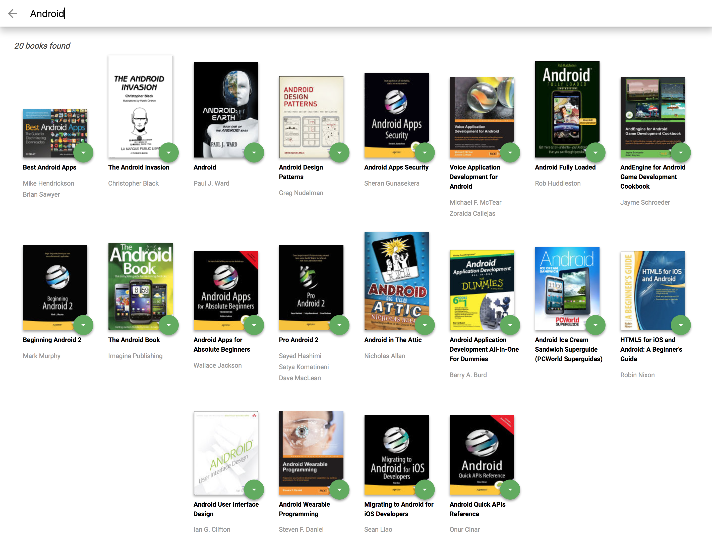

# My Reads Project

### Analysis

My Reads app allows you to track books and place them on one of three bookshelves:

- Current Reading
- Want to Read
- Have Read

A book can be changed from a shelf to another by selecting the new state (arrow icon). If "none" is selected, the book will disappear from the main page.

The application also has a search page that allows users to find books. 

### Hierarchy of components

```jsx
<App/>
├── <HomePage/>
└── <SearchPage/>

<HomePage/>
├── <BookList />
├───── <BookShelf />
├─────── <Book />
├───────── <BookShelfChanger />
├─────── ...
├─────── <Book />
├───── <BookShelf />
├───── <BookShelf />
└── <OpenSearch />

<SearchPage/>
├── <CloseSearch />
├── <SearchBook />
├── <SearchResults />
├───── <Book />
│ ...
└───── <Book />
```

### Setup Project

#### Add Starter files

1. Clone this repository. `git clone https://github.com/BycorSanchez/my-reads.git`
2. Install project dependencies with `npm install`.
3. Start the server with `npm start`.
4. Visit `http://localhost:3000`.

#### Enforcing Code Quality

- Lints JavaScript based on the latest standards, and Fixes issues and formatting errors with Prettier

```
npx install-peerdeps --dev eslint-config-wesbos
```

- Create a `.eslintrc` file:

```
{
  "extends": [
    "wesbos"
  ]
}
```

- Create a `.prettierrc` file:

```
{
  "useTabs": true,
  "singleQuote": true,
  "jsxSingleQuote": true
}
```

### Technologies used

- React.js
- react-router
- react-router-dom
- throttle-debounce
- Books API (provided by Udacity)

### Notes

The backend API uses a fixed set of cached search results and is limited to a particular set of search terms, which can be found in [SEARCH_TERMS.md](https://github.com/BycorSanchez/my-reads/blob/master/SEARCH_TERMS.md).

Most of the code in this project has been written to the ES6 JavaScript specification for compatibility with modern web browsers and future proofing JavaScript code.

___



